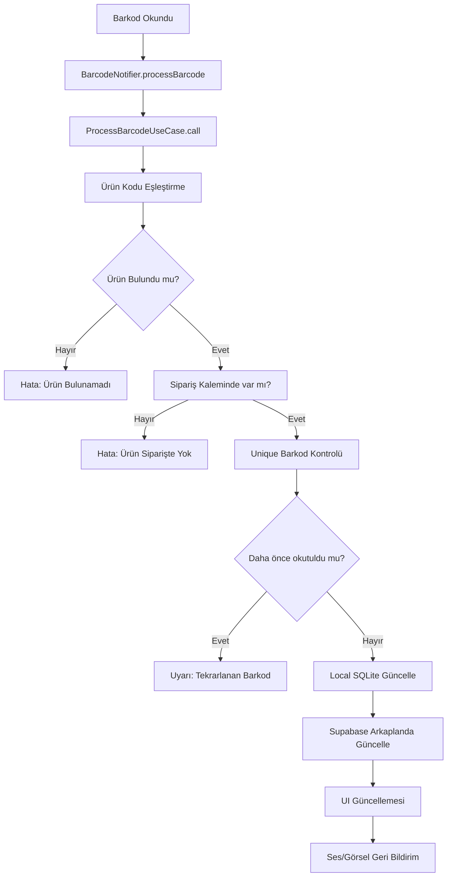
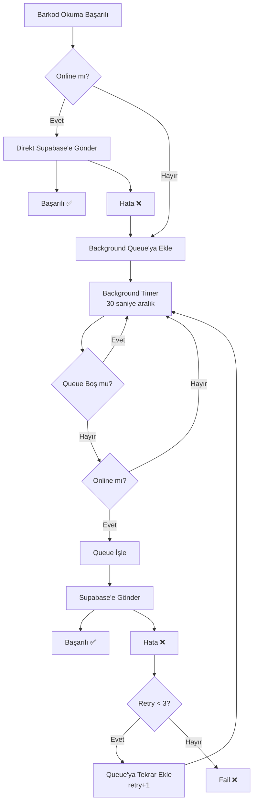

# Flutter Count Track - Özellikler

Bu dokümanda sistemin temel özelliklerini ve çalışma mantığını bulabilirsiniz.

## 🔍 Barkod Okutma Mantığı

### Genel Bakış
Sistem, üretim sürecinde ürünlerin barkodlarını okuyarak sipariş takibi yapmak için geliştirilmiştir. Barkod okuma sistemi MVVM mimarisi ile clean architecture prensiplerini takip eder ve ses/görsel geri bildirim sağlar.

### Çalışma Akışı



### Barkod İşleme Adımları

1. **Barkod Yakalama**
   - Gerçek barkod okuyucu (keyboard eventi)
   - Manuel giriş (test için)
   - Barkod simülatörü (development için)

2. **Ürün Eşleştirme**
   - Önce doğrudan barkod ile ürün aranır
   - Bulunamazsa müşteri ürün kodu eşleştirmesi kontrol edilir
   - `ProductCodeMapping` tablosu kullanılır

3. **Sipariş Kalemi Kontrolü**
   - Ürünün aktif siparişte olup olmadığı kontrol edilir
   - `OrderItem` tablosundan ilgili kayıt bulunur

4. **Unique Barkod Kontrolü**
   - Bazı ürünler için unique barkod gereksinimi vardır
   - `BarcodeReads` tablosunda tekrar kontrolü yapılır

5. **Miktar Güncelleme**
   - Local SQLite veritabanında `scannedQuantity` artırılır
   - Arkaplanda Supabase'e gönderilir
   - Sipariş durumu güncellenir (kısmi/tamamlandı)

### Arkaplanda Supabase Güncelleme

#### Sistem Özellikleri
- **Offline-First**: Önce local güncellenir, sonra Supabase
- **Background Processing**: UI'ı bloklamadan arkaplanda çalışır
- **Queue Sistemi**: Offline durumunda queue'ya eklenir
- **Retry Mekanizması**: Hata durumunda 3 kez yeniden dener
- **Auto Sync**: 30 saniye aralıklarla otomatik sync

#### Background Queue Mantığı



#### Teknik Detaylar

**BarcodeUpdate Sınıfı:**
```dart
class BarcodeUpdate {
  final String orderCode;      // Sipariş kodu
  final String barcode;        // Okutulan barkod
  final int? productId;        // Ürün ID'si
  final int scannedQuantity;   // Yeni taranan miktar
  final DateTime timestamp;    // İşlem zamanı
  final int retryCount;        // Deneme sayısı
}
```

**Background Timer:**
- 30 saniye aralıklarla çalışır
- Queue'daki bekleyen güncellemeleri işler
- Online durumunu kontrol eder
- Batch processing ile verimli çalışır

**Supabase Güncelleme:**
```sql
UPDATE order_items 
SET scanned_quantity = ?, updated_at = NOW()
WHERE order_id = ? AND product_id = ?
```

### Barkod Durumları

#### BarcodeStatus Enum
- `none`: Hiç işlem yok
- `processing`: İşlem devam ediyor
- `success`: Başarılı okuma
- `warning`: Uyarı (tekrarlanan barkod vb.)
- `error`: Hata (ürün bulunamadı vb.)

#### BarcodeProcessResult Enum
- `success`: Başarılı okuma
- `duplicateUniqueBarcode`: Tekrarlanan tekil barkod
- `productNotFound`: Ürün bulunamadı
- `productNotInOrder`: Ürün siparişte değil
- `orderItemAlreadyComplete`: Sipariş kalemi zaten tamamlandı

### Ses ve Görsel Geri Bildirim

#### Ses Sistemi
- **Başarı Sesi**: Yeşil durum, pozitif geri bildirim
- **Uyarı Sesi**: Sarı durum, dikkat gerektirir
- **Hata Sesi**: Kırmızı durum, işlem başarısız

#### Görsel Bildirimler
- **Overlay Notification**: Geçici bildirim
- **Progress Bar Animation**: Miktar artış animasyonu
- **Color Coding**: Durum bazlı renk kodlaması

### Performans Optimizasyonları

1. **Minimum Network Transfer**
   - Sadece gerekli alanlar güncellenir
   - Batch processing kullanılır

2. **Efficient Database Operations**
   - Index'li sorgular
   - Transaction kullanımı
   - Connection pooling

3. **Memory Management**
   - Queue size limiti
   - Auto cleanup
   - Timer management

4. **UI Responsiveness**
   - Background processing
   - Non-blocking operations
   - Progressive updates

### Hata Yönetimi

#### Offline Durumu
- Queue'ya ekleme
- Auto retry mekanizması
- User notification

#### Network Hataları
- Exponential backoff
- Retry limiti (3 kez)
- Fallback strategies

#### Database Hataları
- Transaction rollback
- Data integrity checks
- Error logging

---

## 📱 Diğer Özellikler

### Sipariş Yönetimi
- Excel'den sipariş içe aktarma
- Sipariş listeleme ve filtreleme
- Sipariş durumu takibi
- Kısmi gönderim desteği

### Dashboard ve Raporlama
- Anlık istatistikler
- İlerleme grafikleri
- Zaman bazlı analizler
- Performans metrikleri

### Sistem Mimarisi
- **MVVM Pattern**: Clean separation of concerns
- **Riverpod**: State management
- **Drift**: Type-safe SQL operations
- **Clean Architecture**: Domain-driven design

### Offline Support
- **SQLite**: Local data storage
- **Background Sync**: Auto synchronization
- **Conflict Resolution**: Smart merging
- **Queue Management**: Reliable operations 